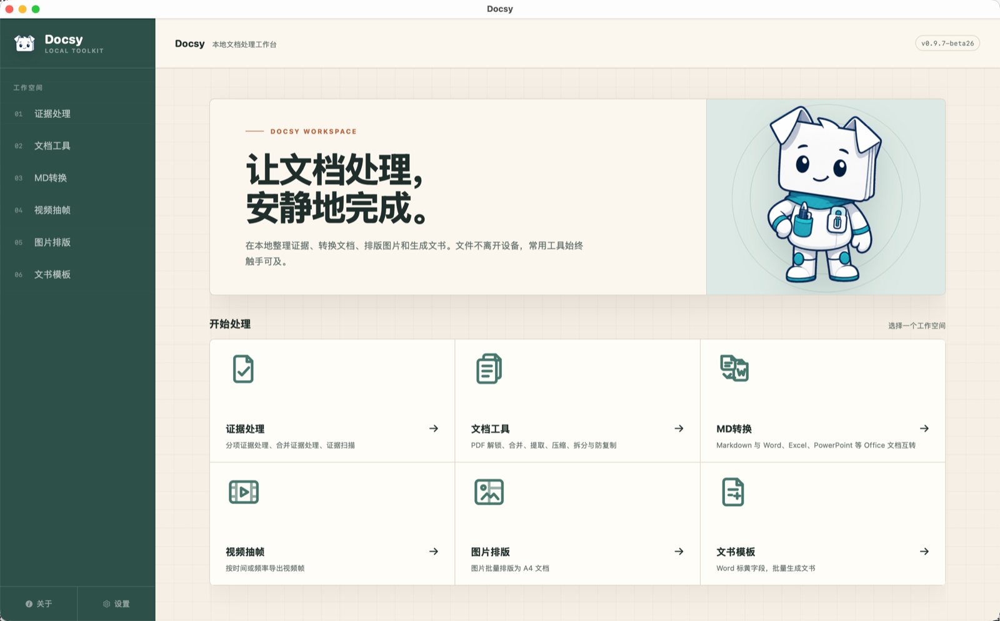
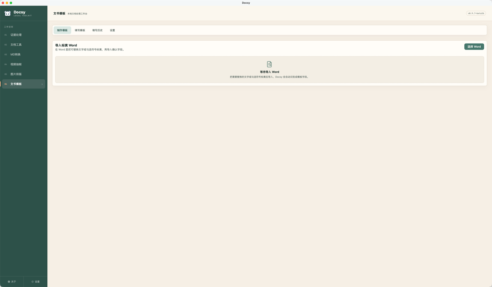
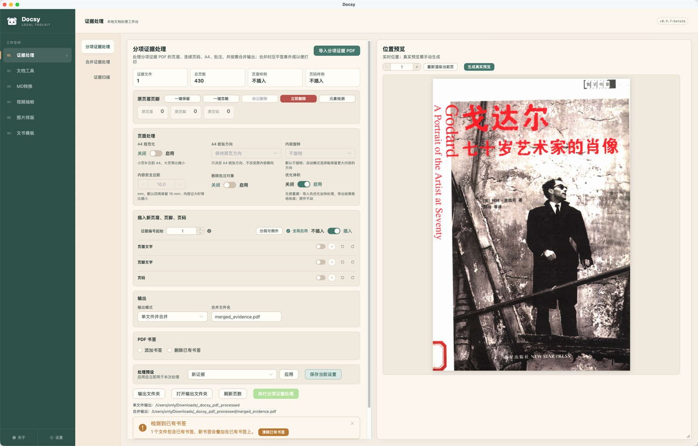
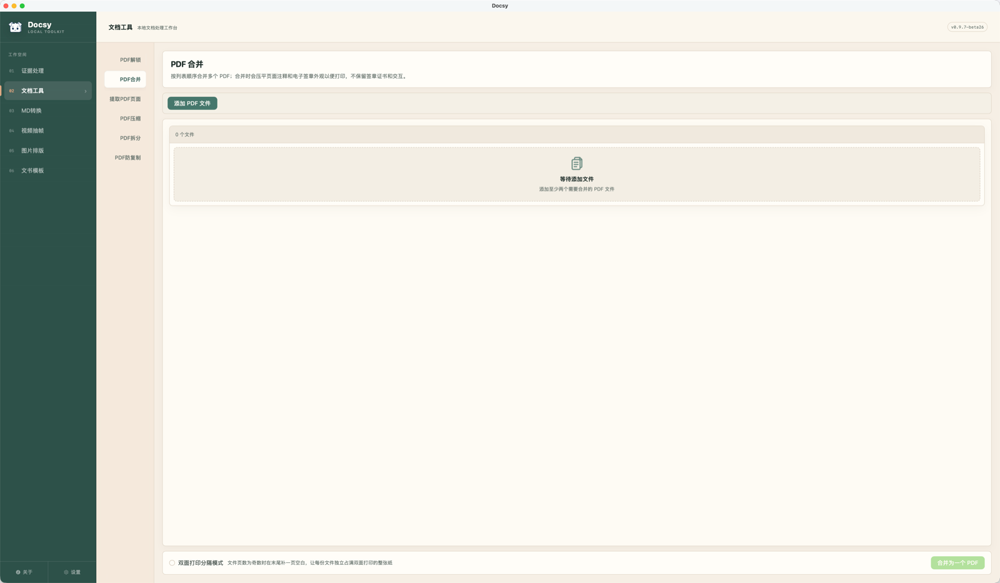
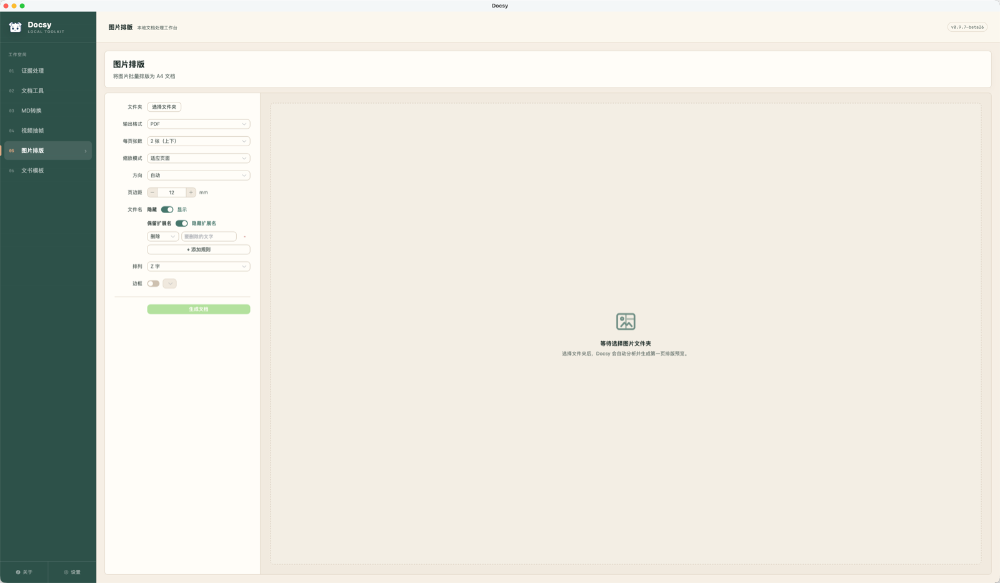
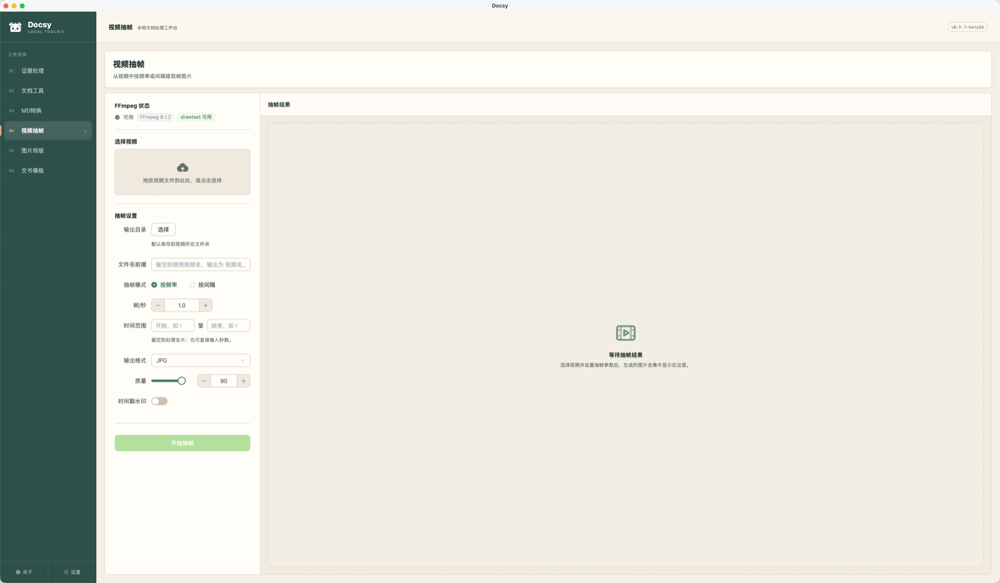
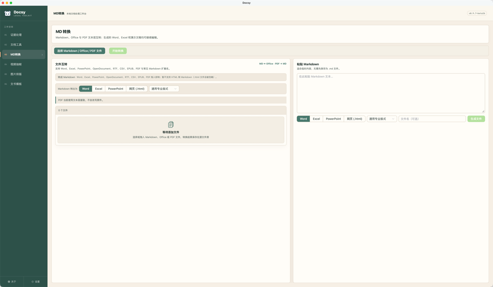

# 📄 Docsy — 你的文档处理百宝箱

> 一个专为法律人、行政党、文字工作者打造的本地文档处理效率工具 ✨  
> 所有操作 100% 在本地电脑完成，**断网可用，绝不上传云端** 🔒

---

## 🏠 首页速览

打开 Docsy 就是清爽直观的卡片工作台，六大核心模块一目了然。

左侧导航栏支持一键展开/收缩（切换紧凑图标模式），工作区设置具备**自动记忆能力**：切换页面或重新打开之前处理过的文件，上一次的选项、排序与调整进度自动为你恢复。

还有一只超可爱的桌宠 **Doclet** 🐾，在遇到大批文件处理或外部工具调用时，它会在界面一角安静地陪你等待～

---

## 📝 文书模板 — 极简实用的 Word「邮件合并」与批量文书生成

> Word 标黄即建模板，表单交互回填，支持 Excel 数据导入一键批量生成 Word 📋

在日常办案、企业法务或行政办公中，经常需要批量制作格式固定但当事人信息不同的文书（如授权委托书、起诉状、通知函、劳动合同、证明信）。传统 Word 的「邮件合并」功能门槛较高、域代码设置繁琐，且格式极易跑偏；若靠纯手工复制替换，不仅费时费力，删改不适用条款时还容易残留孤立标点和语病。Docsy 的文书模板将这一流程彻底简化为：**Word 标黄建模 → 结构化表单录入 → Excel 批量合并导出**。

### ✅ 核心特性
- **标黄即模板（零门槛建模）**：无需在 Word 里配置繁复的邮件合并域代码（`MERGEFIELD`），直接用 Word 自带的高亮工具把待填文字**标黄**，拖入 Docsy 即可自动解析出交互字段模型。
- **支持 Excel 批量合并生成（邮件合并进阶版）**：一键导出与模板完全对应的字段表格（`.xlsx`），分发填好后导回校验，**一键秒级合并生成几十上百份格式严谨的 Word 文书**。
- **8 种实用字段类型**：覆盖实际文书常用场景，包含单行文本、多行文本、日期（支持大写中文日期自动转换）、下拉选择、当事人列表（支持自由增减多行当事人）、引用关联（前文录入后文自动同步）、勾选框与单选/多选组。
- **空值智能消除语病**：普通替换或邮件合并最让人头疼的就是空项残留。Docsy 支持前后缀绑定与智能清理，某个非必填字段留空时自动剔除关联标点与修饰词（如“联系人：【】”留空时整句清理，不留多余冒号或孤立括号）。
- **本地历史沉淀与自动带出**：录入过的信息自动沉淀在本地轻量数据库；不同模板只要字段名相同（如“公司名称”、“统一社会信用代码”、“法定代表人”），就会自动推荐历史数据，大幅减少重复输入。
- **quick-xml 底层保真引擎**：直接解析修改 Word 的底层 OOXML 结构，绝不破坏原有模板的字体、字号、行距、页边距与复杂表格排版，输出的文档与原模板版式分毫不差。

---

## 📂 证据处理 — 专为开庭与办案打造的 PDF 证据工作台

> 页眉页脚智能检测 + 证据编号 + 边界无缝拆合 + 双面打印防混淆，律师证据整理一步到位 📋

整理开庭证据材料往往极耗精力：几十份文件来源各异，自带乱七八糟的原页眉、法院旧案号和旧页码；合卷不仅要逐份标注“证据 1、证据 2”，还要编整卷页码、双面打印、加设目录书签。Docsy 将这套繁琐的流程完全自动化。

### ✅ 核心特性
- **三层智能检测机制**：
  1. **第一层**：PDF Artifact 结构标签精准识别
  2. **第二层**：页面文本流与位置模式匹配
  3. **第三层**：视觉边距区域扫描
  快速挖掘已有旧页眉、原页码，支持一键或逐页保留、删除或修改。
- **证据编号与多规则编排**：
  - 页眉（证据身份，如“证据一”）、页脚文字、页码三套规则独立配置、互不冲突。
  - 页码样式应有尽有：阿拉伯数字、中文数字、大小写罗马数字、带圈数字（❶❷❸ 等）。
  - 支持自定义格式模板（如 `{page}/{total}`、`- {page} -`、`第 {page} 卷`）。
  - 支持全卷连续编号或单份文件独立编号。
- **双面打印防混淆模式**：
  - 勾选后，合并时若某份证据为单数页，Docsy 会自动在其末尾补一页同尺寸的空白页，让每份证据都独占完整纸张，**绝不会出现两份不同的证据印在同一张纸正反面的情况**。
- **合并证据拆分与无缝调整**：
  - 面对他人发来的整本大 PDF 扫描件，支持拖拽调整分栏宽度、页面放大定位。
  - 提供“从本页拆”、“从上一页拆”与自由“添加新页段”按钮，边界修改后相邻页段自动无缝接续；删除某个页段会自动并入上一段，杜绝页码空洞。
  - **自动移除空白页**：拆分与导入时可勾选自动过滤纯白扫描背面与多余分隔页，处理完毕明确提示清理页数。

---

## 🔧 PDF 工具 — 常用基础操作一网打尽

> 拖拽排序 + 即时真实预览，轻量高效，处理完毕原样无损输出 📐

满足日常办公最高频的 PDF 处理需求，拒绝网页在线工具的排队与隐私隐患。

| 工具 | 功能说明 | 常见场景 |
| :--- | :--- | :--- |
| 🔓 **解锁** | 一键移除 PDF 打印、复制与编辑限制 | 收到设了权限密码的合同与公文 |
| 📎 **合并** | 多个 PDF 自由拖拽排序合并，支持双面打印补白 | 汇编多份资料、合卷归档 |
| ✂️ **提取页面** | 支持区间与逗号语法（如 `1, 3, 5-8, 12`）精准提取 | 只要整本资料中的核心几页 |
| 🗜️ **压缩** | 清理冗余对象与元数据，可选图片适度重编码 | 邮件附件超限、系统上传受限 |
| 📑 **拆分** | 按指定页数或自定义区间拆分成独立文档 | 一份文件分拆给不同人员承办 |

---

## 🖼️ 图片排版 — 批量图片秒变标准 A4 文档

> 照片、微信截图、扫描票据 → 整齐划一的 A4 PDF / DOCX 📐

### ✅ 核心特性
- **文件夹自动归类与排序**：支持按文件夹批量导入，自动提取前缀，支持自然数命名排序与手动拖拽微调。
- **自适应紧凑网格**：提供 1×1、1×2、2×2、3×3 等多种宫格排列。最后一页根据剩余图片张数自动紧凑重排，**不会留下突兀的空白占位**；长文件名自适应折行显示。
- **PDF 与 Word（DOCX）双格式导出**：既可以直接生成便于打印归档的 PDF，也可以生成支持后续编辑图注的 Word 文档。
- **实际打印尺寸智能降采样**：根据选择的 300 / 150 DPI 智能计算打印所需真实分辨率，几十上百张高清手机照片也能秒级完成排版，不占多余内存。

---

## 🎬 视频抽帧 — 视频画面精准取证与筛选

> 范围抽帧 / 定频抽帧 + 时间戳水印 + OpenCV 智能选图工作台 🎞️

### ✅ 核心特性
- **精准抽帧**：支持指定时间范围（如 `01:23 - 03:45`）或按固定时间间隔（如每秒 1 帧、每 5 秒 1 帧）提取画面。
- **时间戳水印**：抽取时可直接将精确的播放时间码烧录到画面角标，取证规范度满分。
- **智能选图工作台（OpenCV 赋能）**：
  - 视频抽出的几百张画面往往存在大量静止、重复或运动模糊废片。
  - Docsy 内嵌轻量图像特征分析，结合局部连续性、画面变动幅度与清晰度，自动给出“保留”或“排除”的置信建议，并展示判断依据。
  - **一键直达图片排版**：筛选完毕后，可将保留的画面一键推送到图片排版模块，直接打包成带图注的 A4 打印文书！

---

## 🔄 Markdown 与 Office 互转 — 干净纯粹的文档转换

> 结构化转换，保留标题、表格、列表与图片语义 📝

### ✅ 核心特性
- **Markdown 导出**：将 Markdown 快速转为 排版精良的 **Word (.docx)**、**Excel (.xlsx)**、**PPT (.pptx)** 或 **HTML** 网页。
- **提取 Markdown**：支持将现成的 Word、OpenDocument、RTF、CSV、EPUB 甚至带有文本层的 PDF 转换为结构清晰的 Markdown，方便导入知识库或二次整理。

---

## ⚙️ 设置与系统工具管理

| 功能 | 说明 |
| :--- | :--- |
| 🔍 **外部工具检测与托管** | 自动探测系统或托管目录中的 `qpdf`、`Poppler`、`FFmpeg`，支持在设置页一键下载安装，自动做 SHA256 完整性校验。 |
| 📋 **主菜单自定义** | 左侧模块支持拖拽排序、按需隐藏，只留自己最常用的工具。 |
| 🗑️ **模板回收站** | 误删的文书模板可在回收站中一键恢复或彻底删除。 |
| 📊 **脱敏诊断日志** | 遇到异常时可一键生成脱敏日志并唤起邮件草稿，日志中自动隐去本地真实用户名与案件路径，安全无忧。 |

---

## 🔒 隐私与安全承诺

**你的文件永远不会离开你的电脑。**

- Docsy 是纯本地运行的桌面客户端，所有 PDF 计算、Word 生成与图像处理都在本机 CPU / 内存中完成。
- 不设云端服务、不回传任何文档数据、不采集隐私信息。
- 完全支持在断网或内网隔离环境下长期使用。

---

## 🛠️ 技术架构

Docsy 采用原生桌面现代化技术栈开发：
- **核心框架**：[Tauri 2](https://github.com/tauri-apps/tauri)（轻量、低内存、原生窗口）
- **前端视图**：[Vue 3](https://github.com/vuejs/core) + [Element Plus](https://element-plus.org/) + [Pinia](https://pinia.vuejs.org/)
- **文档引擎**：[quick-xml](https://github.com/tafia/quick-xml)（Word OOXML 解析渲染）、[lopdf](https://github.com/J-F-Liu/lopdf) + [printpdf](https://github.com/fschutt/printpdf)（PDF 结构处理与图文 Overlay）、[calamine](https://github.com/tafia/calamine) + [rust_xlsxwriter](https://github.com/jmcnamara/rust_xlsxwriter)（Excel 批量导入导出）
- **算法支持**：内嵌轻量 [OpenCV](https://opencv.org/)（视频关键帧变动与清晰度度量）

---

## 👤 作者与致谢

- **作者**：木小樨 ([muxiaoxiii](https://github.com/muxiaoxiii))
- **官网**：[docsy.muxiaoxi.top](https://docsy.muxiaoxi.top)
- **开源协议**：本项目基于 [MIT License](LICENSE) 开源，商业使用自由友好。

感谢所有为本项目提供灵感、反馈与测试支持的朋友们！如果 Docsy 帮你在工作里省下了宝贵的时间，欢迎在 GitHub 上点个 **⭐ Star** 支持一下～
