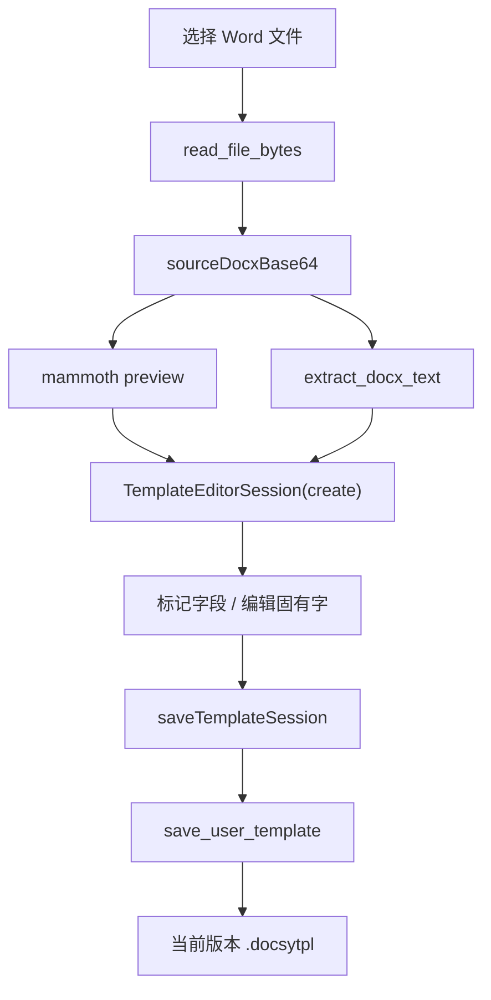
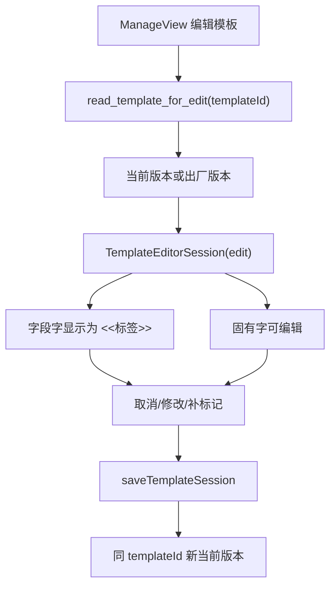
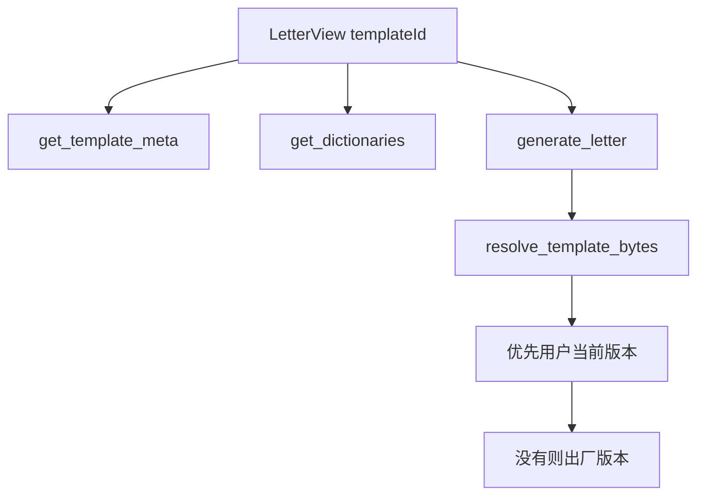

# TemplateEditor 重构方案

本文档给 MIMO 执行模板编辑器重构使用。目标不是重新设计一个新功能，而是把当前 `TemplateView.vue` 中已经存在的模板制作/编辑能力，收敛成一个架构清晰、行为一致、后续可继续扩展的 `TemplateEditor`。

## 0. 文档状态

更新时间：2026-06-06

本文当前定位是架构设计文档，不是代码实现记录。MIMO 后续实现时应以本文的分层、状态机、数据契约和验收清单为准；如果实现中发现必须偏离，应先把偏离原因写回本文，再改代码。

当前实现状态：

- 第一轮前端重构已落地：`TemplateView.vue` 已变成壳组件，核心实现迁入 `src/features/template-editor/`。
- API、mammoth 预览、session、mark、固有字编辑、保存逻辑已拆到独立 service/composable。
- 旧模板取消标记已补交互：没有原字时要求用户输入恢复文本，留空表示删除。
- 条件占位符 `{{?key:text}}` 不再显示 `<<条件:key>>`，只显示正文 `text`。
- 已增加本地日志链路：前端模板编辑器 API 调用、后端模板读取/保存/docx 文本替换会写入 `logs/docsy-YYYYMMDD.log`。
- 已确认模板语义模型：模板不是一段 HTML，而是 docx 原始结构、可替换文本标记、隐藏 OOXML/格式信息、Docsy 规则元数据的组合。
- 字典不应从字段标记原文自动生成；字段 key、`{{field_N}}` 占位符不能进入推荐值。
- 用户模板当前版本以 `.docsytpl` 为主：模板编辑器、模板管理、生成器都围绕同一份包读写字段、字典和 docx。
- 已进入第三阶段实现：预览层按 docx 字符偏移渲染 source-indexed 固有字 span 和不可编辑字段 token；固有字编辑直接生成 docx text patch。
- 模板管理页不再物理删除字段：字段只允许从生成页隐藏/恢复；真正取消模板字段必须进入模板编辑器取消标记，防止生成页、管理页、template.docx 三者割裂。
- 文本偏移统一按 Unicode code point 处理，避免中文夹杂特殊字符时 `start/end` 与后端 docx 文本范围不一致。
- 后端 Rust 文件拆分、字符级源位置索引、基础格式工具栏仍属于后续阶段，不是当前可用性的阻塞项。

本次架构设计补齐了这些内容：

- `TemplateEditor` 的分层边界。
- `TemplateEditorSession` 的完整数据契约。
- create/edit 统一状态机。
- 字段字、固有字、占位符、当前版本之间的关系。
- 前端模块接口、后端命令边界、错误处理和验收策略。

## 1. 背景与目标

当前代码已经具备这些能力：

- 从 Word 文件创建模板。
- 从模板管理页加载已有模板进行编辑。
- 字段以 `marks` 表示，保存时写成 `{{key}}` / `{{*key}}` / `{{#row}}`。
- `.docsytpl` 保存 `manifest.json`、`fields.json`、`dictionaries.json`、`template.docx`、`builder_state.json`。
- 编辑后的稳定 `templateId` 当前版本已能优先参与生成、模板管理字段读取和字典读取。
- 已支持未标记固有字的纯文字替换，并反写 docx 当前编辑源。

但当前实现主要集中在：

- `src/views/TemplateView.vue`：约 1000 行，混合 UI、状态、定位、预览、保存逻辑。
- `src-tauri/src/template_builder.rs`：同时承担 docx 解析、偏移改写、模板包读写、模板列表等职责。

重构目标：

1. 制作模板和编辑模板使用同一个 `TemplateEditor` 内核。
2. `create` 和 `edit` 只是初始化 session 的不同入口，不允许复制两套流程。
3. 所有编辑都围绕 `TemplateEditorSession` 进行。
4. 保存后生成页、模板管理、字典、历史都读取同一个稳定 `templateId` 的当前版本。
5. 字段字和固有字边界清晰：字段字不能直接改文字，取消标记后恢复为固有字；固有字可以编辑。
6. 纯文字编辑的目标交互是直接在预览区编辑固有字；当前“先选中再弹窗输入”只能作为过渡实现。
7. 先稳定架构和纯文字能力，不在本轮实现复杂 Word 富文本编辑器。

### 1.1 模板语义模型

Docsy 模板应明确拆成四类内容：

1. **固有内容**：模板中不需要替换的文字及其格式。用户编辑模板时应能直接修改这些文字，格式默认继承原 docx run/paragraph。
2. **字段内容**：模板中需要替换的文字，以 `marks` 表示；保存时写入 `{{key}}`、`{{*key}}`、`{{#row}}` 等占位符。字段字不能直接在正文里改文字，必须通过字段属性或取消标记后再作为固有字编辑。
3. **隐藏结构**：OOXML 中不直接显示但影响版式的 run、段落、表格、样式、关系、header/footer 等。编辑器不能丢弃这部分，也不能从 HTML 反推出最终 docx。
4. **Docsy 规则**：`fields.json`、`dictionaries.json`、`builder_state.json`、可见性、行重复、自动编号、字典源等。它们必须由 Docsy 显式维护，不能从预览 HTML 或字段原文隐式猜测。

因此，编辑器的真实编辑对象必须是 `sourceDocxBase64 + text index + marks + rules`，预览 HTML 只是显示层。

### 1.3 三端一致的数据流

Docsy 有三个用户入口，但它们不能各自维护一份模板状态：

- **文件生成器**：读取当前模板的 `template.docx`、`fields.json`、`dictionaries.json`，只负责填写字段并生成文件。
- **模板管理**：修改字段标签、必填、可见性、字典源、字典内容；对于用户模板，必须直接写回 `.docsytpl` 当前版本。
- **模板编辑器**：修改模板正文、字段标记、字段属性；保存后必须更新同一份 `.docsytpl` 当前版本。

用户模板的当前版本规则：

```text
user_templates/<templateId>.docsytpl
  manifest.json
  fields.json
  dictionaries.json
  template.docx
  builder_state.json
```

读取规则：

1. 生成器、管理页、编辑器都先读 `.docsytpl` 当前版本。
2. 为兼容旧版本，读取时允许合并历史覆盖配置 `templates/<templateId>.json` 和 `templates/dict_<templateId>.json`。
3. 一旦模板管理或模板编辑器保存，必须把有效配置写回 `.docsytpl`，避免长期依赖外部覆盖。

写入规则：

1. 模板编辑器保存：更新 `template.docx`、`fields.json`、`dictionaries.json`、`builder_state.json`。
2. 模板管理保存用户模板：只更新 `.docsytpl` 内的 `fields.json` 和 `dictionaries.json`，不改 docx 和 builder_state。
3. 模板管理保存内置模板：仍使用用户覆盖配置，因为内置资源是编译进程序的出厂资源。
4. 归档可以继续保存到 `templates/`，但归档不是当前真源。

字段管理规则：

1. 管理页不能直接删除仍存在于模板正文中的字段配置。
2. “隐藏字段”只表示该字段不在生成表单出现，字段配置和模板标记仍保留。
3. 生成器对隐藏字段传空值，并把该字段按自动隐藏处理，避免模板中的字段 token 失去配置。
4. 用户要真正删除模板字段，必须到模板编辑器取消标记；取消后该段文字恢复为固有字或由用户输入恢复文本。
5. 后续如果要支持“删除字段”，也必须先检测该 key 是否仍被 `marks` 或 `template.docx` 占位符引用；仍被引用时只能隐藏，不能物理删除。

### 1.2 预览区直接编辑

用户对固有字的编辑应尽量在预览区直接完成，而不是“选中 -> 气泡 -> 输入”。当前气泡输入的问题：

- 操作路径长。
- 用户难以感知自己正在编辑的是正文还是字段。
- 连续修改多处固有字时效率低。

目标方案：

- 预览层展示为近似 Word/WPS 的可编辑文档视图。
- 固有字对应的文本节点可直接编辑。
- 字段字显示为不可编辑 token，支持点击选中、取消标记、修改字段属性。
- 编辑固有字时，前端把 DOM 文本变更映射回 `plainText` 字符偏移，再调用后端对 docx 当前源做文字替换。
- 不能把 mammoth HTML 直接当最终文档保存；直接编辑只负责产生“文字替换操作”，最终仍由后端改写 docx。

第三阶段实现规则：

1. 预览 HTML 不再承担保存职责，只承担交互职责。
2. 固有字渲染为 `.docsy-fixed-text[data-start][data-end]`，这就是前端 source index。
3. 字段渲染为 `.docsy-field-token[contenteditable=false][data-start][data-end]`，禁止直接输入。
4. 用户修改固有字时，只比较被编辑的 fixed-text span，生成 `start/end/replacement`。
5. 后端 `edit_docx_text_range` 改写 `sourceDocxBase64`，前端重新提取 plainText、重新渲染 source-indexed preview，并平移后续 marks。
6. 如果用户操作导致字段 token 丢失、跨 token 编辑、或一次产生多段不连续编辑，编辑器必须拒绝并重新渲染。
7. 保存仍走 `saveTemplateSession(session)`，最终写入 `.docsytpl`。

当前第三阶段边界：

- source index 已经在纯文本层落地，可以保证编辑固有字不再靠全局模糊匹配。
- 编辑器只比较 `.docsy-fixed-text` 自身变化；字段 token 丢失或被改动会拒绝并重新渲染。
- 一次失焦产生多处 fixed-text 变化时，按从后往前的顺序逐个应用 docx patch，避免偏移互相影响。
- 前端文本范围工具统一使用 Unicode code point 长度和切片；任何 mark 的 `start/end` 都不能再混用 JavaScript UTF-16 下标。
- 版式仍是 Docsy 自研文本预览，不承诺完整复刻 Word/WPS 页面。
- 后续如要达到真正 WYSIWYG，需要把 OOXML run/paragraph 样式映射到 source-indexed preview node，但数据流和 patch 机制保持不变。

## 2. 当前问题

### 2.1 前端职责混杂

`TemplateView.vue` 当前承担了所有事情：

- 选择 Word 文件。
- 加载已有模板。
- base64 编解码。
- mammoth 预览。
- 选区定位。
- 重复文本候选。
- 字段属性表单。
- 已标记字段列表。
- 标签预览。
- 固有字编辑。
- 组装 `fields`、`dictionaries`、`builder_state`。
- 调用保存命令。

这导致任何小改动都会碰到大组件，难以判断影响范围。

### 2.2 create/edit 还没有抽象成统一 session

代码里已有两个初始化入口：

- `pickFile()`
- `loadExistingTemplate(id)`

但二者初始化完后并没有显式进入同一个 `TemplateEditorSession` 模型，只是直接写一组散落的 refs：

- `docxLoaded`
- `filename`
- `docxBase64`
- `previewHtml`
- `originalHtml`
- `plainText`
- `marks`
- `manifest`
- `pending`

后续应把这些 refs 变成统一 session 的字段。

### 2.3 预览渲染和业务状态耦合

`highlightMarks()`、`renderLabelPreview()`、`renderPlaceholderPreview()` 同时读取和写入业务状态与 HTML 字符串。  
这使得预览模式切换、mark 更新、固有字编辑后重渲染都容易互相影响。

### 2.4 选区定位仍是纯文本模糊匹配

`findMatchingRangesInPlain(text)` 目前通过 mammoth HTML 选中文本在 docx 纯文本里查找位置。它已经支持空白归一和重复位置候选，但仍不是长期底座。

后续应逐步升级为：

```text
docx XML -> text index -> preview node source range -> selection range
```

本轮重构不强求完成字符级索引，但新架构必须给它留位置。

### 2.5 后端模块边界粗

`template_builder.rs` 同时包含：

- docx 纯文本提取。
- docx 范围替换。
- placeholder 写入。
- run 合并。
- 模板包保存。
- 模板包读取。
- 模板列表。
- base64 编解码。

本轮可先不大拆 Rust 文件，但前端 API 命名和文档要以未来边界为准。

## 3. 目标架构

### 3.0 架构总览

`TemplateEditor` 应按四层组织：

```text
View Shell
  只负责路由参数、页面挂载、全局事件转发
Editor Orchestrator
  只负责 session 生命周期、命令分发、错误提示
Domain Composables
  负责预览、选区、mark、固有字编辑、保存 payload
Infrastructure Services
  负责 Tauri invoke、mammoth、base64、后端数据映射
```

对应到文件：

```text
src/views/TemplateView.vue
  -> View Shell

src/features/template-editor/TemplateEditorView.vue
  -> Editor Orchestrator

src/features/template-editor/composables/*
  -> Domain Composables

src/features/template-editor/services/*
  -> Infrastructure Services
```

这四层的依赖方向必须单向：

```text
View Shell
  -> TemplateEditorView
    -> composables
      -> services
```

禁止反向依赖：

- `services` 不 import Vue 组件。
- composable 不直接读取 DOM，除非它的名字明确表示处理 DOM selection。
- UI 子组件不直接 `invoke`。
- 保存 payload 只能由 `useTemplateSave` 或 mapper 生成。

### 3.0.1 运行时数据流

```text
Word/docx/current template
  -> sourceDocxBase64
  -> plainText + previewHtml
  -> TemplateEditorSession
  -> editor actions
  -> save payload
  -> .docsytpl current version
  -> generation/manage/dictionaries/history read same templateId
```

架构判断标准：

1. 任意时刻都能从 session 看出编辑器处于什么状态。
2. 任意保存都走同一条 `saveTemplateSession(session)`。
3. 任意字段显示、取消标记、固有字编辑都不会绕过 session。
4. 任意后端读取都按稳定 `templateId` 定位当前版本。

### 3.0.2 状态机

编辑器不是一组散落按钮，而是下面这台状态机：

```text
idle
  -> loadingSource
  -> ready
  -> selectingText
  -> editingMark
  -> editingFixedText
  -> saving
  -> ready
```

错误状态不单独成为页面模式，而是 action 失败后回到最近的稳定状态：

| 当前状态 | 失败场景 | 回退 |
|---|---|---|
| `loadingSource` | 文件读取、mammoth、文本提取失败 | `idle` 或保持上一 session |
| `selectingText` | 无法定位选区 | `ready` |
| `editingMark` | mark 与已有 mark 重叠、字段信息不合法 | 保持 `editingMark` |
| `editingFixedText` | 选区覆盖字段、后端替换失败 | `ready` |
| `saving` | 后端命中校验失败、写文件失败 | `ready` 且保留 dirty session |

建议类型：

```ts
type TemplateEditorStatus =
  | "idle"
  | "loadingSource"
  | "ready"
  | "selectingText"
  | "editingMark"
  | "editingFixedText"
  | "saving";
```

### 3.0.3 架构不变量

这些规则比组件拆分更重要，MIMO 实现时不能破坏：

1. `sourceDocxBase64` 是当前编辑源，不是临时预览源。
2. `plainText` 必须从 `sourceDocxBase64` 或原始文件提取，不能从 mammoth HTML 反推。
3. `marks` 的 `start/end` 永远对应 `plainText` 的字符偏移。
4. 字段字只由 `marks` 表示，不允许作为普通可编辑文本直接改。
5. 固有字是 `plainText` 中未被任何 mark 覆盖的区间。
6. 固有字编辑必须反写 `sourceDocxBase64`，并重新提取 `plainText`。
7. 保存时 `fields` 由 `marks` 派生；不要维护第二份可漂移字段表。
8. create/edit 不允许分叉保存逻辑。
9. 编辑内置模板后，保存结果仍使用同一个稳定 `templateId`。
10. `versionId` 可以内部生成，但不能改变用户看到的模板身份。

### 3.1 核心模型

新增前端 session 概念：

```ts
type TemplateEditorMode = "create" | "edit";

type TemplateEditorSourceKind = "localDocx" | "currentTemplate" | "builtinTemplate";

type TemplateEditorSession = {
  status: TemplateEditorStatus;
  mode: TemplateEditorMode;
  sourceKind: TemplateEditorSourceKind;
  templateId: string | null;
  versionId: string | null;
  sourceFilename: string;
  manifest: TemplateManifest;
  sourceDocxBase64: string;
  plainText: string;
  marks: TemplateMark[];
  dictionaries: TemplateDictionaries;
  preview: TemplatePreviewState;
  selection: TemplateSelectionState | null;
  pendingMark: PendingTemplateMark | null;
  dirty: boolean;
  lastSavedAt: string | null;
  diagnostics: TemplateEditorDiagnostic[];
};
```

字段标记：

```ts
type TemplateMark = {
  start: number;
  end: number;
  key: string;
  label: string;
  type: "text" | "date" | "select" | "party";
  visibility: "full" | "value_only" | "auto";
  required: boolean;
  row_repeat?: boolean;
  auto_number?: boolean;
  dict_source?: string;
  text: string;
};
```

预览状态：

```ts
type TemplatePreviewState = {
  mode: "marked" | "labels";
  html: string;
  originalHtml: string;
};
```

建议补充这些类型，避免后续把临时 UI 状态塞回 mark：

```ts
type TemplateSelectionState = {
  text: string;
  range: [number, number] | null;
  locationChoices: TemplateLocationChoice[];
  duplicateChoices: TemplateDuplicateChoice[];
  anchorRect: DOMRect | null;
};

type PendingTemplateMark = TemplateMark & {
  reuseKey?: string;
  locationKey?: string;
  locationChoices?: TemplateLocationChoice[];
  duplicateChoices?: TemplateDuplicateChoice[];
};

type TemplateLocationChoice = {
  key: string;
  start: number;
  end: number;
  label: string;
};

type TemplateDuplicateChoice = {
  key: string;
  label: string;
  type: TemplateMark["type"];
  visibility: TemplateMark["visibility"];
  required: boolean;
  row_repeat?: boolean;
  auto_number?: boolean;
  text: string;
};

type TemplateEditorDiagnostic = {
  level: "info" | "warning" | "error";
  code: string;
  message: string;
  markKey?: string;
};
```

`TemplateField[]` 不建议长期放在 session 里作为独立状态。它应该在保存前由 `marks` 派生，或在字段属性编辑时通过 mark 更新。这样可以避免 mark 改了但 field 没同步。

### 3.1.1 Session 初始化契约

`create` 和 `edit` 的区别只发生在初始化输入：

| 模式 | 输入 | 输出 |
|---|---|---|
| `create` | 本地 `.docx` 路径 | `TemplateEditorSession(create)` |
| `edit` | 稳定 `templateId` | `TemplateEditorSession(edit)` |

二者初始化完成后必须拥有同一结构：

```ts
{
  sourceDocxBase64,
  plainText,
  preview.originalHtml,
  marks,
  dictionaries,
  manifest
}
```

初始化函数建议：

```ts
async function createSessionFromLocalDocx(path: string): Promise<TemplateEditorSession>
async function createSessionFromTemplateId(templateId: string): Promise<TemplateEditorSession>
```

`createSessionFromTemplateId` 规则：

1. 调 `read_template_for_edit(templateId)`。
2. 如果有 `builder_state.sourceDocxBase64`，优先作为 `sourceDocxBase64`。
3. 如果没有 `builder_state`，使用后端返回的 `docxBase64`，并从占位符反推 marks。
4. 前端不自己猜测当前版本路径。

### 3.1.2 保存契约

保存 payload 必须由 session 单向派生：

```ts
type SaveTemplateSessionInput = {
  id: string;
  name: string;
  docxBase64: string;
  marks: TemplateMark[];
  fields: { fields: TemplateField[] };
  dictionaries: TemplateDictionaries;
  builderState: TemplateBuilderState;
};
```

`builderState` 至少包含：

```ts
type TemplateBuilderState = {
  version: 1;
  sourceDocxBase64: string;
  sourceFilename: string;
  marks: TemplateMark[];
  savedAt: string;
};
```

保存动作只允许一条路径：

```ts
await saveTemplateSession(session)
```

内部顺序：

1. 校验 session 可保存。
2. 从 `marks` 派生 `fields`。
3. 从 `marks` 派生或合并 `dictionaries`。
4. 构造 `builderState`。
5. 调 `save_user_template`。
6. 保存成功后将 `dirty=false`，更新 `lastSavedAt`。

### 3.2 文件结构建议

建议新增目录：

```text
src/features/template-editor/
  TemplateEditorView.vue
  components/
    TemplateEditorToolbar.vue
    TemplatePreviewPane.vue
    MarkAside.vue
    MarkPopover.vue
    TextEditDialog.vue
  composables/
    useTemplateEditorSession.js
    useTemplatePreview.js
    useTemplateMarks.js
    useTemplateTextEdit.js
    useTemplateSave.js
  services/
    templateEditorApi.js
    templateEditorMappers.js
  utils/
    textRange.js
    htmlEscape.js
```

兼容方式：

- 保留 `src/views/TemplateView.vue`，但让它只作为薄壳，转发到 `TemplateEditorView.vue`。
- 不要求一次性改路由或父组件。

示例：

```vue
<template>
  <TemplateEditorView
    :edit-template-id="editTemplateId"
    @templates-changed="$emit('templates-changed')"
  />
</template>
```

### 3.3 组件职责

#### TemplateEditorView.vue

职责：

- 接收 `editTemplateId`。
- 根据是否有 `editTemplateId` 初始化 create/edit 模式。
- 组合 toolbar、preview、aside、popover。
- 不直接写复杂算法。

不应包含：

- docx base64 编解码细节。
- mark 去重算法。
- fields/dictionaries 组装细节。
- HTML 替换细节。

#### TemplateEditorToolbar.vue

职责：

- 模板名称输入。
- 预览模式切换。
- 插入字段。
- 编辑固有字。
- 重新选择。
- 保存。

只 emit 命令，不直接操作 session 细节。

#### TemplatePreviewPane.vue

职责：

- 展示当前预览 HTML。
- 捕获 mouseup selection。
- 将 DOM selection 交给 `useTemplateMarks` / `useTemplateTextEdit` 处理。

不得直接修改 marks。

#### MarkAside.vue

职责：

- 展示当前 marks。
- 编辑 mark。
- 取消 mark。

取消标记必须通过 session action，不直接 splice。

#### MarkPopover.vue

职责：

- 字段属性表单。
- 复用已有字段。
- 重复位置候选。
- 保存或取消 pending mark。

它只编辑 `pendingMark`，最终通过 action 提交。

#### TextEditDialog.vue

职责：

- 固有字替换输入。
- 处理重复位置选择。

文本替换必须走后端 `edit_docx_text_range`，不能只改前端 HTML。

### 3.3.1 组件事件契约

UI 子组件只 emit 用户意图，不直接修改 session 深层状态。

#### TemplateEditorToolbar.vue emits

```ts
type ToolbarEmit =
  | { type: "pick-source" }
  | { type: "save" }
  | { type: "switch-preview-mode"; mode: "marked" | "labels" }
  | { type: "insert-field" }
  | { type: "edit-fixed-text" }
  | { type: "reset" };
```

#### TemplatePreviewPane.vue emits

```ts
type PreviewEmit =
  | { type: "selection-change"; selection: DOMSelectionSnapshot }
  | { type: "selection-clear" };
```

`DOMSelectionSnapshot` 只在事件层出现，不进入长期 session：

```ts
type DOMSelectionSnapshot = {
  text: string;
  anchorRect: DOMRect;
};
```

#### MarkAside.vue emits

```ts
type MarkAsideEmit =
  | { type: "edit-mark"; index: number }
  | { type: "remove-mark"; index: number };
```

#### MarkPopover.vue emits

```ts
type MarkPopoverEmit =
  | { type: "confirm-mark"; pending: PendingTemplateMark }
  | { type: "cancel-mark" }
  | { type: "reuse-field"; key: string }
  | { type: "choose-location"; key: string };
```

### 3.3.2 命令分发模型

`TemplateEditorView.vue` 建议维护一个轻量 command dispatcher。所有 UI 事件汇入这里，再调用 composable action：

```ts
async function dispatch(command: TemplateEditorCommand) {
  switch (command.type) {
    case "load-local-docx":
      return loadFromFile(command.path);
    case "load-template":
      return loadFromTemplateId(command.templateId);
    case "selection-change":
      return beginMarkSelection(command.selection);
    case "confirm-mark":
      return confirmPendingMark(command.pending);
    case "remove-mark":
      return removeMark(command.index);
    case "edit-fixed-text":
      return beginFixedTextEdit();
    case "save":
      return saveTemplateSession(session.value);
  }
}
```

好处：

- 按钮不关心 session 内部结构。
- 后续添加快捷键、右键菜单、工具栏命令时不复制逻辑。
- 错误处理可以集中在 dispatcher 层。

### 3.4 composable 职责

#### useTemplateEditorSession.js

负责 session 生命周期：

```js
const {
  session,
  loadFromFile,
  loadFromTemplateId,
  resetSession,
  refreshPreviewFromDocx,
  markDirty,
} = useTemplateEditorSession();
```

约束：

- `loadFromFile` 和 `loadFromTemplateId` 最终都生成同一个 session 结构。
- 不允许组件分别维护 `docxBase64`、`plainText`、`marks` 等散落状态。
- 所有 session mutation 通过明确 action 完成，避免组件直接改深层字段。

建议对外暴露：

```js
const session = shallowRef(createEmptySession());

function assertReadySession() {}
function replaceSession(nextSession) {}
function updateSession(patch) {}
function markDirty(reason) {}
function clearDirty() {}
```

`updateSession` 只做浅层 patch；涉及 marks、preview、text replacement 的动作放到对应 composable。

#### useTemplatePreview.js

负责预览渲染：

```js
renderOriginalPreview(session)
renderMarkedPreview(session)
renderLabelPreview(session)
```

约束：

- 输入 session，输出 html。
- 不直接 mutate session，除非函数名明确是 action。
- `marked` 模式可以继续使用当前 HTML 替换策略。
- `labels` 模式必须继续基于 `plainText + marks`，用于检查字段覆盖。
- 预览渲染失败不得破坏 session，最多写入 diagnostic。

建议输出：

```js
function computePreviewHtml(session) {}
function computeMarkedHtml(originalHtml, marks) {}
function computeLabelHtml(plainText, marks) {}
function computePlaceholderFallbackHtml(originalHtml, fields) {}
function refreshPreview(session, mode) {}
```

长期目标：

```text
mammoth HTML + docx source index -> preview spans with source range
```

第一阶段仍可保留当前 HTML 替换策略，但必须被包在 `useTemplatePreview` 里，不能留在 View。

#### useTemplateMarks.js

负责字段标记：

```js
createPendingMarkFromSelection(selectionText)
confirmPendingMark(pending)
editMark(index)
removeMark(index)
findDuplicateChoices(text, range)
findMatchingRangesInPlain(text)
```

约束：

- `removeMark` 只取消字段标记，不改变 docx 源文字。
- 取消标记后，该文字自然回到固有字，因为下一次保存不会把该范围替换为 placeholder。
- 旧模板没有 `builder_state.json` 时，如果该范围当前是 `{{key}}` 占位符，必须先让用户输入恢复后的固有字；用户留空表示删除该段文字，然后反写 docx 再移除 mark。
- 不允许直接编辑字段字文字。
- 新增 mark 前必须检查与已有 mark 是否重叠。
- 同一个 key 可以有多个 mark，但生成页只出现一个字段。
- mark 排序统一按 `start ASC, end ASC`。

建议 action：

```js
function beginSelection(selectionSnapshot) {}
function buildPendingMark(selectionState) {}
function confirmPendingMark(pending) {}
function updateMark(index, patch) {}
function removeMark(index) {}
function normalizeMarks(marks) {}
function validateMarkRange(mark, marks) {}
function overlapsAnyMark(range, marks, exceptIndex = -1) {}
```

mark 重叠规则：

```text
rangeA overlaps rangeB <=> A.start < B.end && A.end > B.start
```

禁止：

- 嵌套 mark。
- 半重叠 mark。
- 固有字编辑跨过 mark。

允许：

- 多个不重叠 mark 使用同一个 key。
- 取消某个 mark 后保留同 key 的其他 mark。

#### useTemplateTextEdit.js

负责固有字编辑：

```js
editPlainTextRange(selectionText)
applyTextReplacement(range, replacement)
shiftMarksAfterEdit(range, delta)
```

约束：

- 替换范围不得与任何 mark 重叠。
- 替换必须调用后端 `edit_docx_text_range`。
- 替换成功后重新提取 plainText、重新 mammoth 渲染、重新渲染 marks。
- 后续 marks 偏移必须按 replacement 长度差调整。

建议 action：

```js
function beginFixedTextEdit(selectionSnapshot) {}
function resolveEditableTextRange(selectionText) {}
function assertRangeIsFixedText(range, marks) {}
async function applyTextReplacement(range, replacement) {}
function shiftMarksAfterTextEdit(marks, range, delta) {}
```

偏移调整规则：

| mark 位置 | 处理 |
|---|---|
| `mark.end <= range.start` | 不变 |
| `mark.start >= range.end` | `start/end += delta` |
| 与 range 重叠 | 禁止替换 |

替换成功后的刷新顺序：

```text
edit_docx_text_range
  -> sourceDocxBase64 = nextBase64
  -> extract_docx_text_from_base64
  -> plainText = nextPlainText
  -> mammoth.convertToHtml
  -> preview.originalHtml = nextHtml
  -> marks = shiftedMarks
  -> refreshPreview
  -> dirty = true
```

#### useTemplateSave.js

负责保存：

```js
buildFieldsFromMarks(session)
buildDictionariesFromMarks(session)
buildBuilderState(session)
saveTemplateSession(session)
```

约束：

- 保存 create/edit 统一入口。
- 不允许 create 和 edit 分别组装不同 payload。
- 保存 payload 必须继续兼容 `save_user_template`。
- 保存前必须做字段合法性和 mark 命中前置校验；最终命中校验以后端为准。

保存前校验：

```js
function validateBeforeSave(session) {
  assert(session.sourceDocxBase64);
  assert(session.marks.length > 0);
  assert(noOverlappingMarks(session.marks));
  assert(allMarksHaveKeyAndLabel(session.marks));
  assert(allMarkTextStillMatchesPlainText(session));
}
```

字段派生规则：

1. 按 mark 出现顺序遍历。
2. 同 key 只生成一个 field。
3. field 属性取该 key 第一个 mark 的属性。
4. 后续同 key mark 如果属性不同，应提示合并冲突，不能静默覆盖。

字典派生规则：

1. 新字段默认可把原选中文本写入该字段候选。
2. 编辑旧模板时要合并原 `dictionaries`，不要只保留本次 mark 文本。
3. 字典合并只去重，不自动删除用户已有候选。

### 3.5 services

#### templateEditorApi.js

封装 Tauri commands：

```js
readFileBytes(path)
extractDocxText(path)
extractDocxTextFromBase64(base64)
readTemplateForEdit(id)
editDocxTextRange({ docxBase64, start, end, replacement })
saveUserTemplate(args)
```

组件和 composables 不直接 import `invoke`。

建议每个 API 返回前端稳定结构，不把后端字段名扩散到组件：

```js
export async function readTemplateForEdit(templateId) {
  return invoke("read_template_for_edit", { id: templateId });
}

export async function saveUserTemplate(args) {
  return invoke("save_user_template", { args });
}

export async function editDocxTextRange(args) {
  return invoke("edit_docx_text_range", { args });
}
```

错误处理规则：

1. `templateEditorApi` 不弹 UI 消息，只 throw 标准 Error。
2. `TemplateEditorView` 或 dispatcher 负责把 Error 转成 `ElMessage`。
3. `templateEditorApi` 必须记录 invoke 开始、成功、失败，日志只允许包含命令名、模板 id、数量、长度、错误信息，不允许记录完整 docx/base64/HTML/文书正文。
4. 后端字符串错误在 API 层包装为：

```js
throw new TemplateEditorError("BACKEND_COMMAND_FAILED", String(err), { command });
```

建议错误类型：

```js
class TemplateEditorError extends Error {
  constructor(code, message, meta = {}) {
    super(message);
    this.code = code;
    this.meta = meta;
  }
}
```

日志定位规则：

- `read_template_for_edit` 失败时，应能从日志看到 `templateId`、是否进入后端命令、后端返回的具体错误。
- `save_user_template` 失败时，应能从日志看到 `templateId`、`marksCount`、`fieldsCount`、是否带 `builder_state`、失败位置。
- `edit_docx_text_range` 失败时，应能从日志看到 `start/end`、替换文字长度、输入输出字节长度或后端错误。
- 前端日志写入失败时只能降级到 `console`，不能阻断用户操作。

#### templateEditorMappers.js

负责后端数据和前端 session 之间转换：

```js
createSessionFromFile({ filename, docxBase64, plainText, html })
createSessionFromTemplateEditData(id, data)
sessionToSaveArgs(session)
```

mapper 是兼容旧数据的主要位置。旧模板没有 `builder_state.json` 时，只允许 mapper 做降级反推，UI 和 composable 不关心旧格式细节。

建议 mapper 接口：

```js
function mapTemplateEditDataToSession(templateId, data) {}
function mapLocalDocxToSession({ path, filename, docxBase64, plainText, html }) {}
function mapSessionToSaveArgs(session) {}
function mapMarksToFields(marks) {}
function mapMarksToBuilderState(session) {}
function mapLegacyPlaceholdersToMarks(data, plainText) {}
```

`mapTemplateEditDataToSession` 规则：

1. `manifest.id` 优先使用传入的稳定 `templateId`。
2. `sourceDocxBase64` 优先使用 `builder_state.sourceDocxBase64`，否则使用 `data.docxBase64`。
3. `marks` 优先使用 `builder_state.marks`，否则使用 `data.marks` + `fields` 反推。
4. `manifest.name` 为空时用 `templateId`。
5. 字典缺失时用空对象，不在 UI 层判断 null。
6. 旧模板取消标记时不得保留 `{{key}}`；必须由用户输入恢复文本或确认留空删除。

`mapSessionToSaveArgs` 规则：

```js
{
  id: session.templateId || slugify(session.manifest.name),
  name: session.manifest.name,
  docxBase64: session.sourceDocxBase64,
  marks: normalizeMarks(session.marks),
  fields: { fields: mapMarksToFields(session.marks) },
  dictionaries: session.dictionaries,
  builder_state: mapMarksToBuilderState(session)
}
```

如果当前后端参数名仍是 snake_case，mapper 负责转换；组件层只使用 camelCase。

### 3.5.1 mammoth 适配层

不要在多个 composable 里直接 import `mammoth`。建议建立：

```text
services/docxPreviewService.js
```

接口：

```js
async function renderDocxHtmlFromBase64(base64) {}
async function renderDocxHtmlFromArrayBuffer(arrayBuffer) {}
```

原因：

- 后续如果替换 mammoth 或补 source map，只改这一处。
- 当前 mammoth HTML 与 docx XML 的差异可以集中记录。
- 预览渲染失败和警告可以统一收集为 diagnostics。

## 4. 后端边界建议

本轮重构可以不强制拆 Rust 文件，但建议最终目标如下：

```text
src-tauri/src/template_builder/
  mod.rs
  package.rs       # .docsytpl 读写、manifest/fields/dictionaries/builder_state
  docx_text.rs     # extract_plain_text、字符索引
  docx_edit.rs     # replace_text_range、未来格式编辑
  placeholders.rs  # rewrite_with_placeholders
  routes.rs        # current version lookup
```

如果 MIMO 要做后端拆分，必须保持现有 Tauri command 名称兼容，除非同步改前端。

当前必须保留的命令：

- `read_template_for_edit`
- `save_user_template`
- `extract_docx_text`
- `extract_docx_text_from_base64`
- `edit_docx_text_range`
- `get_template_meta`
- `get_dictionaries`
- `generate_letter`

### 4.1 后端职责分层

后端能力分三类，不要混在一个概念里：

| 层 | 责任 | 当前位置 | 未来位置 |
|---|---|---|---|
| 模板包层 | `.docsytpl` 读写，manifest/fields/dictionaries/builder_state | `template_builder.rs` | `package.rs` |
| docx 文本层 | 提取纯文本、替换固有字、写 placeholder | `template_builder.rs` | `docx_text.rs`、`docx_edit.rs`、`placeholders.rs` |
| 当前版本路由 | 内置模板、用户当前版本、恢复出厂规则 | `template_builder.rs`、`lib.rs` | `routes.rs` |

MIMO 第一轮实现建议只在前端分层，Rust 侧最多移动纯函数。原因是当前版本路由刚刚打通，过早重排后端文件会提高回归风险。

### 4.2 后端命令语义

#### `read_template_for_edit(id)`

语义：按稳定 `templateId` 读取可编辑源。

返回必须满足：

- `manifest`
- `fields`
- `dictionaries`
- `docxBase64`
- `marks`
- `builderState`

优先级：

```text
user current version
  -> builtin template
  -> error
```

前端不应该知道磁盘路径。

#### `save_user_template(args)`

语义：把 session 保存为某个稳定 `templateId` 的当前版本。

后端负责：

1. 把 `sourceDocxBase64` 按 marks 写入 placeholder。
2. 校验每个 mark 都命中。
3. 写 `.docsytpl`。
4. 保留 `builder_state.json`。

前端负责：

1. 保证 marks 不重叠。
2. 派生 fields。
3. 提供 builder_state。

#### `edit_docx_text_range(args)`

语义：只替换固有字纯文本。

后端负责：

1. 按 docx XML 字符偏移替换。
2. 尽量保留起始 run 样式。
3. 不做字段语义判断。

前端负责：

1. 确认 range 不与 mark 重叠。
2. 替换后重算 plainText 和 preview。
3. 调整后续 marks 偏移。

### 4.3 未来后端能力预留

基础格式工具栏以后不要复用 `edit_docx_text_range` 硬扩参数，建议新增：

```rust
edit_docx_run_style_range(args)
```

概念参数：

```ts
type EditDocxRunStyleRangeArgs = {
  docxBase64: string;
  start: number;
  end: number;
  stylePatch: {
    fontFamily?: string;
    fontSizePt?: number;
    bold?: boolean;
    italic?: boolean;
    underline?: boolean;
  };
};
```

约束：

- 只允许作用于固有字区间。
- 需要拆 run，但不能破坏 `<w:p>`、`<w:tbl>`、`<w:tr>`、`<w:tc>`。
- 保存后仍通过 `sourceDocxBase64` 进入 `save_user_template`。

## 5. 当前版本和模板身份规则

必须遵守：

1. `templateId` 是用户可见稳定身份。
2. `versionId` 是内部内容版本。
3. 当前实现可继续用 `user_templates/<templateId>.docsytpl` 表示当前激活版本。
4. 未来扩展版本归档时，可迁移为：

```text
user_templates/
  <templateId>/
    active.json
    versions/
      <versionId>.docsytpl
```

5. 无论使用哪种磁盘结构，对外命令都按稳定 `templateId` 工作。
6. 所有读取模板内容的路径必须优先读取用户当前版本，没有当前版本时才回退出厂内置版本。

涉及路径：

- 生成：`resolve_template_bytes(templateId)`
- 字段：`get_template_meta(templateId)`
- 字典：`get_dictionaries(templateId)`
- 编辑：`read_template_for_edit(templateId)`
- 管理：`ManageView` 中字段/字典/历史均按同一 `templateId`

### 5.1 与模板管理模块的关系

模板编辑器不是新的业务子模块，它是模板管理模块里的“编辑模板”能力。前端可以按工程结构放到 `src/features/template-editor/`，但用户心智上仍属于模板管理。

入口规则：

1. `ManageView` 中每个模板行都应能触发编辑，包括内置模板、用户模板、已停用但可恢复的模板。
2. 点击“编辑模板”传递稳定 `templateId`。
3. `TemplateEditorView` 保存成功后 emit `templates-changed`。
4. `ManageView` 收到后刷新当前模板字段、字典、状态。
5. 生成页下一次读取同一 `templateId` 时必须读到编辑后的当前版本。

页面关系：

```text
ManageView
  -> editTemplate(templateId)
  -> App navigate("edit:<templateId>")
  -> TemplateView shell
  -> TemplateEditorView(editTemplateId)
```

不要做：

- 不要在一级菜单新增“模板编辑子模块”来替代模板管理。
- 不要让编辑器保存成新的用户模板 ID，导致原模板在生成页仍是旧版本。
- 不要让“编辑内置模板”走独立逻辑。

### 5.2 恢复出厂与版本替换

当前用户想要的是：编辑后的模板在用户视角上取代原模板，但内部仍保留恢复能力。

因此：

```text
templateId = 用户可见模板身份
versionId = 内部内容版本
```

当前实现可以继续用：

```text
user_templates/<templateId>.docsytpl
```

表示当前版本。恢复出厂时删除或停用这个用户当前版本即可。

未来升级为多版本后，建议：

```text
user_templates/
  <templateId>/
    active.json
    versions/
      <versionId>.docsytpl
```

但前端 API 不应变化，仍只传 `templateId`。

## 6. 用户交互规范

### 6.1 创建模板

流程：

1. 用户选择 `.docx`。
2. 初始化 `TemplateEditorSession(create)`。
3. 预览显示原文。
4. 用户选中固有字，标记为字段。
5. 保存时生成稳定 `templateId`，写入当前版本。

### 6.2 编辑模板

流程：

1. 模板管理中点击某个模板的“编辑模板”。
2. 加载稳定 `templateId` 当前版本。
3. 初始化 `TemplateEditorSession(edit)`。
4. 字段字显示为 `<<标签>>` 或按钮化样式。
5. 固有字保持普通文本显示，可选中后编辑。
6. 用户可取消标记，取消后该范围恢复为固有字。
7. 保存后写入同一 `templateId` 的新当前版本。

旧模板补充规则：如果旧模板没有 `builder_state.json`，编辑器无法自动知道字段原本是哪几个字。用户点击“取消标记”时应弹窗输入恢复后的固有字；确认后替换掉 `{{key}}` 占位符，再把该 mark 移除。

### 6.3 字段字

字段字规则：

- 字段字不可直接输入修改。
- 字段字点击后进入字段属性编辑。
- 要修改字段字本身，必须先取消标记，使其恢复为固有字。
- 字段保存时按 mark 变成 placeholder，生成时由用户输入值替换。

### 6.4 固有字

固有字规则：

- 未被 mark 覆盖的普通文本可以编辑。
- 第一阶段只支持纯文字替换。
- 替换必须反写 docx 源文件。
- 替换范围不能与 mark 重叠。
- 替换后要调整后续 mark 偏移。

### 6.5 基础格式工具栏

本轮重构只预留架构，不要求实现。

未来工具栏包括：

- 字体
- 字号
- 加粗
- 斜体
- 下划线

实现要求：

- 只能作用于固有字选区。
- 不能作用于字段按钮。
- 必须反写 docx run 样式。
- 不能只改 mammoth HTML。

## 7. 迁移步骤

迁移原则：

1. 每个阶段只解决一个架构问题。
2. 每个阶段都必须保持功能可运行。
3. 每个阶段完成后更新本文对应章节的实际状态。
4. 不允许“顺手重写 UI 交互”混在架构拆分里。
5. 如果某阶段发现代码现状和本文冲突，先改本文记录决策，再改代码。

### 阶段 1：无行为变化的结构拆分 ✅ 已完成

目标：把 `TemplateView.vue` 拆薄，不改变功能。

步骤：

1. 新建 `src/features/template-editor/`。✅
2. 把 `TemplateView.vue` 变成壳组件。✅
3. 抽出 `TemplateEditorView.vue`，先搬迁原 template/script/style。✅
4. 抽出 `templateEditorApi.js`，封装所有 `invoke`。✅
5. 抽出 `templateEditorMappers.js`，封装 base64、后端数据到 session 的转换。✅
6. 保持 `npm run build` 通过。✅

额外完成：

- 抽出 `docxPreviewService.js`，封装 mammoth 调用。✅
- 抽出 `utils/textRange.js`，封装文本范围工具函数。✅
- 抽出 `utils/htmlEscape.js`，封装 HTML 转义函数。✅

验收：

- 新建模板功能不变。✅
- 编辑已有模板功能不变。✅
- 保存后生成页仍读当前版本。✅
- 没有新增行为。✅

完成时间：2026-06-05

### 阶段 2：引入 TemplateEditorSession ✅ 已完成

目标：把散落 refs 合并为 session。

步骤：

1. 新建 `useTemplateEditorSession.js`。✅
2. 把以下状态合并进 session：✅
   - `filename` → `session.sourceFilename`
   - `docxBase64` → `session.sourceDocxBase64`
   - `previewHtml` → `session.preview.html`
   - `originalHtml` → `session.preview.originalHtml`
   - `plainText` → `session.plainText`
   - `marks` → `session.marks`
   - `manifest` → `session.manifest`
3. `pickFile()` 改为 `loadFromFile()`。✅
4. `loadExistingTemplate()` 改为 `loadFromTemplateId()`。✅
5. 确保 create/edit 初始化后得到同一 session 结构。✅

验收：

- create/edit 后 UI 呈现一致。✅
- 保存 payload 与重构前一致。✅
- `builder_state.json` 内容不缺字段。✅

完成时间：2026-06-05

### 阶段 3：拆 preview 和 mark 逻辑 ✅ 已完成

目标：把预览渲染和字段操作从 View 中抽离。

步骤：

1. 新建 `useTemplatePreview.js`。✅
2. 移动：✅
   - `computePreviewHtml`、`computeMarkedHtml`、`computeLabelHtml`、`computePlaceholderFallbackHtml`
   - `resolveMarkEnd`、`replaceFirstEquivalentText`
3. 新建 `useTemplateMarks.js`。✅
4. 移动：✅
   - `buildPendingMark`、`confirmPendingMark`、`applyLocationChoice`
   - `removeMark`、`nextFieldKey`、`guessType`、`suggestLabel`

验收：

- 重复文本位置候选仍出现。✅
- 相同文本可复用字段。✅
- 标签预览仍按偏移显示。✅
- 取消标记后保存不会再生成该 placeholder。✅

完成时间：2026-06-05

### 阶段 4：拆固有字编辑 ✅ 已完成

目标：把纯文字替换封装成独立 action。

步骤：

1. 新建 `useTemplateTextEdit.js`。✅
2. 移动 `editSelectedText`。✅
3. 将”定位选区、选择重复位置、输入替换文字、调用后端、调整 marks、刷新预览”拆成小函数。✅
4. 对 mark 重叠检测写成独立函数。✅

验收：

- 选中固有字可替换。✅
- 选中字段字提示先取消标记。✅
- 替换后后续字段位置不乱。✅
- 保存后再打开模板，文字修改仍存在。✅

完成时间：2026-06-05

### 阶段 5：拆 UI 组件 ✅ 已完成

目标：让 `TemplateEditorView.vue` 只做组合。

步骤：

1. 抽 `TemplateEditorToolbar.vue`。✅
2. 抽 `TemplatePreviewPane.vue`。✅
3. 抽 `MarkAside.vue`。✅
4. 抽 `MarkPopover.vue`。✅
5. 抽 `TextEditDialog.vue`，继续用 `ElMessageBox.prompt`，暂不抽。✅（按计划跳过）

验收：

- 组件 props/emit 清晰。✅
- 不在子组件里直接调用 `invoke`。✅
- 不在 UI 组件里组装保存 payload。✅

完成时间：2026-06-05

### 阶段 6：后端边界整理 ✅ 已完成

目标：减少 `template_builder.rs` 的职责。

实际执行（按重构文档建议，第一轮只做轻量拆分）：

1. 增加后端单元测试，覆盖：✅
   - base64 编解码往返
   - 普通文本替换
   - placeholder 写入
   - placeholder 未命中报错
   - 嵌套段落修复
   - 相邻 run 合并

验收：

- `cargo check` 通过。✅
- `cargo test` 通过（7 个测试）。✅
- 原 Tauri command 名称不变。✅
- 前端无需知道后端文件拆分。✅

完成时间：2026-06-05

### 阶段 7：字符级源位置索引 ⚠️ 前端底座已完成，后端 source map 待做

目标：把当前“HTML 选中文本 -> plainText 模糊匹配”升级为稳定定位底座。

已完成：

1. `labels/edit` 预览基于 `plainText + marks` 生成，不再从 mammoth HTML 反推保存范围。
2. 固有字渲染为 `.docsy-fixed-text[data-start][data-end]`。
3. 字段字渲染为 `.docsy-field-token[contenteditable=false][data-start][data-end]`。
4. 直接编辑固有字时由 source-indexed span 生成 `start/end/replacement`。
5. 前端范围计算统一按 Unicode code point，避免 UTF-16 下标混入 mark 偏移。

待完成：

1. 后端 `extract_docx_text` 返回字符到 XML 节点的 source map。
2. 前端 preview 渲染时给文本节点附带 source range。
3. DOM selection 直接映射到 docx source range。
4. `findMatchingRangesInPlain` 降级为 fallback。

验收：

- 连续空格人名定位稳定。
- 同名重复文本能准确选择具体位置。
- 跨 run 选区保存成功率提升。
- 标签预览和 Word 生成结果一致性提高。

### 阶段 8：基础格式工具栏

目标：在架构稳定后给固有字加轻量格式编辑。

步骤：

1. 增加 `useTemplateFormatEdit.js`。
2. 增加 `edit_docx_run_style_range` 后端命令。
3. 工具栏只对固有字选区启用。
4. 格式变更后刷新 `sourceDocxBase64`、preview 和 dirty。

验收：

- 加粗、斜体、下划线、字号、字体只影响固有字。
- 字段字按钮不可格式化。
- 表格结构不变。
- 保存后再次编辑仍能看到格式。

## 8. 数据流

### 8.1 创建模板



### 8.2 编辑模板



### 8.3 生成文件



## 9. 不应做的事

1. 不要把制作模板和编辑模板拆成两个不同组件，各自维护状态。
2. 不要只修改 mammoth HTML 预览却不反写 docx。
3. 不要在 UI 组件里直接拼保存 payload。
4. 不要让 `letter` 编辑后生成仍走出厂模板。
5. 不要让 `templateId` 随内部版本变化。
6. 不要在字段字上启用普通文本编辑。
7. 不要为了实现基础格式，破坏 Word 表格结构或段落结构。

## 9.1 架构决策记录

### ADR-001：编辑器属于模板管理能力，不作为用户侧新模块

决策：代码可以放在 `src/features/template-editor/`，但入口仍从模板管理进入。

原因：用户的目标是管理和编辑全部模板，不是学习一个新的“模板编辑子系统”。

影响：

- `ManageView` 是主入口。
- `TemplateView.vue` 可以继续作为路由壳。
- 保存后必须刷新模板管理和生成页读取链路。

### ADR-002：create/edit 使用同一个 session

决策：新建模板和编辑模板只允许初始化不同，后续状态、预览、标记、固有字编辑、保存全部共用。

原因：二者本质都是“对一份 docx 建立或修改字段标记与模板元数据”。

影响：

- 禁止复制 `pickFile` 和 `loadExistingTemplate` 后续流程。
- 保存只允许 `saveTemplateSession` 一条路径。

### ADR-003：字段字不可直接编辑

决策：字段字显示为 `<<标签>>` 或按钮化样式，不能直接改文字。

原因：字段字不是 Word 固有文本，而是 mark 对应的占位符语义。直接改会让 mark、field、placeholder 三者漂移。

影响：

- 要改字段字原文，必须先取消标记。
- 取消后该范围恢复为固有字，可编辑、可重新标记。

### ADR-004：固有字编辑必须反写 docx

决策：固有字纯文本替换走后端 `edit_docx_text_range`，不能只改 HTML。

原因：mammoth HTML 只是预览，生成文件只认 docx。

影响：

- 替换后必须重新提取 `plainText`。
- 替换后必须重新渲染 mammoth preview。
- 后续 marks 偏移必须调整。

### ADR-005：第一轮重构前端优先，后端保守

决策：第一轮重点拆前端架构，Rust 侧保持命令兼容。

原因：当前模板当前版本路由已经可用，后端大拆容易引入生成链路回归。

影响：

- 可以先新增前端 service/mapper 隔离后端。
- Rust 文件拆分放在阶段 6。

## 9.2 MIMO 文件级交付清单

MIMO 第一轮应交付：

```text
src/views/TemplateView.vue
src/features/template-editor/TemplateEditorView.vue
src/features/template-editor/components/TemplateEditorToolbar.vue
src/features/template-editor/components/TemplatePreviewPane.vue
src/features/template-editor/components/MarkAside.vue
src/features/template-editor/components/MarkPopover.vue
src/features/template-editor/composables/useTemplateEditorSession.js
src/features/template-editor/composables/useTemplatePreview.js
src/features/template-editor/composables/useTemplateMarks.js
src/features/template-editor/composables/useTemplateTextEdit.js
src/features/template-editor/composables/useTemplateSave.js
src/features/template-editor/services/templateEditorApi.js
src/features/template-editor/services/templateEditorMappers.js
src/features/template-editor/services/docxPreviewService.js
src/features/template-editor/utils/textRange.js
src/features/template-editor/utils/htmlEscape.js
```

可暂缓：

```text
src/features/template-editor/components/TextEditDialog.vue
src/features/template-editor/composables/useTemplateFormatEdit.js
src-tauri/src/template_builder/*
```

暂缓原因：

- `TextEditDialog` 可以先继续用 `ElMessageBox.prompt`。
- 格式工具栏是第二阶段能力。
- 后端拆分需要单独回归测试。

## 10. 验收清单

### 功能验收

- 从 Word 新建模板，标记字段，保存，生成文件正常。
- 从模板管理编辑用户模板，补标记，保存，生成文件使用新模板。
- 从模板管理编辑内置 `letter`，保存后生成使用用户当前版本。
- 模板管理字段配置修改后，生成页读取同一字段配置。
- 模板管理字典修改后，生成页候选值一致。
- 模板管理隐藏字段后，生成页不显示该字段；模板编辑器再次打开仍能看到该字段 mark。
- 固有字替换后保存，再打开模板仍能看到修改。
- 字段字不能直接编辑，必须先取消标记。
- 取消标记后保存，原字段不再进入生成表单。

### 架构验收

- `TemplateView.vue` 是薄壳。
- `TemplateEditorView.vue` 不直接包含大段算法。
- 所有 Tauri invoke 集中在 `templateEditorApi.js`。
- create/edit 都进入同一个 `TemplateEditorSession`。
- 保存只有一条 `saveTemplateSession` 路径。
- 预览渲染、mark 操作、固有字编辑分别在独立 composable 中。

### 技术验收

- `npm run build` 通过。
- `cargo check` 通过。
- 不新增明显的大包依赖。
- 不改变现有 Tauri command 对外名称，除非同步修改所有调用点。
- 不破坏已有 `builder_state.json` 兼容。

## 11. 推荐执行顺序

建议 MIMO 按以下顺序提交，避免一次性大改难以回归：

1. 新建目录和薄壳，不改行为。
2. 抽 API 和 mapper。
3. 引入 session。
4. 抽 preview。
5. 抽 marks。
6. 抽 text edit。
7. 抽 UI 子组件。
8. 可选拆后端。

每一步都需要至少跑：

```bash
npm run build
cd src-tauri && cargo check
```

如果某一步失败，优先回退该步，不要混入下一步改动。
