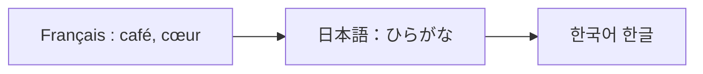

# 多语言转换验证

Français : café, cœur, Noël, é — 日本語・ひらがな・カタカナ — 한국어 한글 — 中文 😀

$\text{café cœur 日本語 한국어} = \frac{1}{2}$

```mermaid
flowchart LR
 A["Français : café, cœur"] --> B["日本語：ひらがな"] --> C["한국어 한글"]
```

Prix : 20 € et US$5 ; 価格：￥100 ; 가격：₩2000